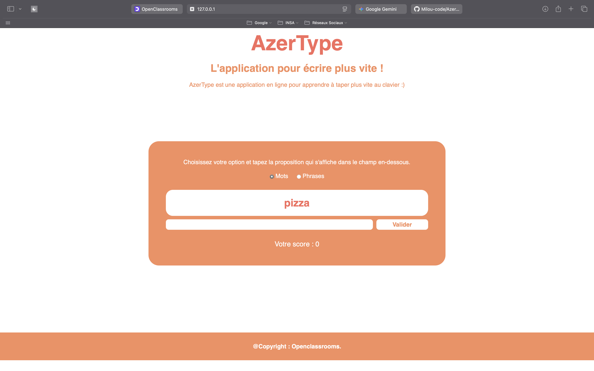

# AzerType - Le jeu de dactylographie dynamique

Ce projet a été réalisé dans le cadre du cours **"Apprenez à programmer avec JavaScript"** d'OpenClassrooms. L'objectif est de mettre en pratique les bases de JavaScript : manipulation du DOM, gestion des événements, variables, boucles et fonctions.

## 📝 Présentation du projet
AzerType est une application web interactive conçue pour aider les utilisateurs à améliorer leur vitesse de frappe au clavier. Le jeu propose de recopier des mots ou des phrases le plus rapidement possible pour accumuler des points.

## 📸 Aperçu du jeu


## 🚀 Fonctionnalités
* **Mode de jeu sélectionnable** : Possibilité de choisir entre une liste de mots simples ou des phrases plus complexes grâce à des boutons radio.
* **Interaction temps réel** : Validation de la saisie par clic sur le bouton "Valider" ou via la touche **Entrée** du clavier.
* **Gestion du score** : Affichage dynamique du score au fur et à mesure de la progression (ex: "3 / 6").
* **Fin de partie** : Désactivation du bouton de validation et message de fin lorsque toutes les propositions ont été traitées.
* **Interface Responsive** : Le design s'adapte aux différentes tailles d'écran grâce au CSS.

## 🛠️ Structure des fichiers
Le projet est organisé de la manière suivante :
* `index.html` : La structure HTML de la page avec les zones de proposition, de saisie et de score.
* `style/style.css` : La mise en forme graphique et la gestion du responsive design.
* `scripts/config.js` : Contient les données du jeu (listes `listeMots` et `listePhrases`).
* `scripts/script.js` : Contient la logique principale du jeu (gestion des scores, affichage des propositions, écouteurs d'événements).
* `scripts/main.js` : Point d'entrée du script qui lance l'exécution du jeu.

## ⚙️ Installation
1.  Clonez ce dépôt sur votre machine locale :
    ```bash
    git clone [https://github.com/votre-pseudo/votre-repo.git](https://github.com/votre-pseudo/votre-repo.git)
    ```
2.  Ouvrez le fichier `index.html` dans votre navigateur préféré.

## 💡 Concepts JavaScript abordés
* **Variables et Portée (Scope)** : Utilisation de variables locales (`score`, `i`) au sein de la fonction `lancerJeu`.
* **Événements** : Utilisation de `addEventListener` pour détecter les clics, les changements d'options et les touches du clavier.
* **Manipulation du DOM** : Utilisation de `querySelector` et `getElementById` pour modifier le contenu HTML.
* **Fonctions imbriquées** : Définition de `validerMot` à l'intérieur de `lancerJeu` pour accéder aux variables locales.

## 📝 Licence
Ce projet est réalisé dans un but pédagogique. Les ressources graphiques et les textes proviennent du contenu de formation OpenClassrooms.
